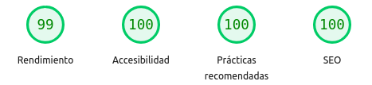

# ⌨️ Testclado — Prueba tu velocidad de tipeo

## 📝 Descripción

Testclado es una aplicación web diseñada para **medir tu velocidad de tipeo en tiempo real**. Proporciona una interfaz visual donde puedes escribir una frase, recibir estadísticas detalladas de tu desempeño (como palabras por minuto, precisión y errores) y seguir mejorando con la práctica. También incluye funciones básicas para verificar si todas las teclas de tu teclado responden correctamente.

Ideal para quienes desean mejorar su velocidad de escritura o verificar el estado general de su teclado.

### Link

- Demo: [Link](https://sebastianguanque.github.io/testclado/)

---

## 📚 Tabla de Contenidos

- [⌨️ Testclado — Prueba tu velocidad de tipeo](#️-testclado--prueba-tu-velocidad-de-tipeo)
  - [📝 Descripción](#-descripción)
    - [Link](#link)
  - [📚 Tabla de Contenidos](#-tabla-de-contenidos)
  - [💡 Acerca del Proyecto](#-acerca-del-proyecto)
  - [✨ Características](#-características)
  - [🛠️ Tecnologías Utilizadas](#️-tecnologías-utilizadas)
  - [⚡ Rendimiento Web](#-rendimiento-web)
  - [🚀 Primeros Pasos](#-primeros-pasos)
    - [Prerrequisitos](#prerrequisitos)
    - [Instalación](#instalación)
  - [🏃 Uso](#-uso)
  - [📄 Licencia](#-licencia)
  - [📧 Contacto](#-contacto)

---

## 💡 Acerca del Proyecto

**Testclado** nace con el objetivo de ofrecer una herramienta clara, veloz y funcional para practicar mecanografía y evaluar tu rendimiento al escribir. Al escribir frases propuestas por la app, puedes ver en tiempo real qué tan rápido y preciso eres, y obtener estadísticas que te ayudarán a seguir mejorando.

Además, si alguna tecla no responde correctamente, también podrás notarlo de inmediato gracias a la retroalimentación visual del teclado virtual.

---

## ✨ Características

- **Prueba de mecanografía:** Mide tu velocidad de tipeo escribiendo frases predefinidas.
- **Estadísticas en tiempo real:** Obtén métricas como PPM, precisión y errores al finalizar la prueba.
- **Retroalimentación visual del teclado:** Muestra qué teclas presionás en tiempo real.
- **Detección de teclas inactivas:** Identifica fácilmente si alguna tecla no responde.
- **Diseño intuitivo y minimalista:** Enfocado en la práctica sin distracciones.

---

## 🛠️ Tecnologías Utilizadas

Este proyecto se basa en las tecnologías web fundamentales, lo que garantiza su ligereza y compatibilidad:

- **Frontend:** HTML5, CSS3, JavaScript

---

## ⚡ Rendimiento Web

La calidad y la eficiencia son fundamentales. A continuación, se presenta un análisis del rendimiento de la aplicación según las métricas de PageSpeed Insights:

 Aspecto del informe de PageSpeed Insights con puntuaciones de Rendimiento 99, Accesibilidad 100, Prácticas recomendadas 100 y SEO 100.

---

## 🚀 Primeros Pasos

Para obtener una copia local del proyecto y probar tu teclado, sigue estos sencillos pasos:

### Prerrequisitos

Necesitas un navegador web moderno (como Chrome, Firefox, Edge, Safari, etc.) instalado en tu dispositivo.

### Instalación

1. Clona o descarga el repositorio a tu máquina local.

```bash
git clone https://github.com/sebastianguanque/testclado.git
cd testclado
```

2. Abre el archivo `index.html` en tu navegador web preferido:
   - Puedes arrastrar el archivo directamente a la ventana del navegador.
   - O hacer doble clic en el archivo `index.html`.

---

## 🏃 Uso

Abre `index.html` en tu navegador. Verás una frase en pantalla y un teclado virtual. Simplemente comenzá a escribir la frase lo más rápido posible usando tu teclado.

Al finalizar, recibirás una serie de estadísticas sobre tu desempeño:

- Palabras por minuto (PPM)

- Errores cometidos

- Precisión (%)

Observa también la retroalimentación visual del teclado virtual para verificar si todas las teclas están funcionando correctamente.

---

## 📄 Licencia

Distribuido bajo la Licencia MIT. Consulta el archivo `LICENSE` en el repositorio para más detalles.

---

## 📧 Contacto

Sebastián Guanque  
🔗 Gmail: [guanquesebastian@gmail.com](guanquesebastian@gmail.com)
🔗 GitHub: [@sebastianguanque](https://github.com/sebastianguanque)  
🔗 Proyecto: [Testclado](https://github.com/sebastianguanque/testclado)
